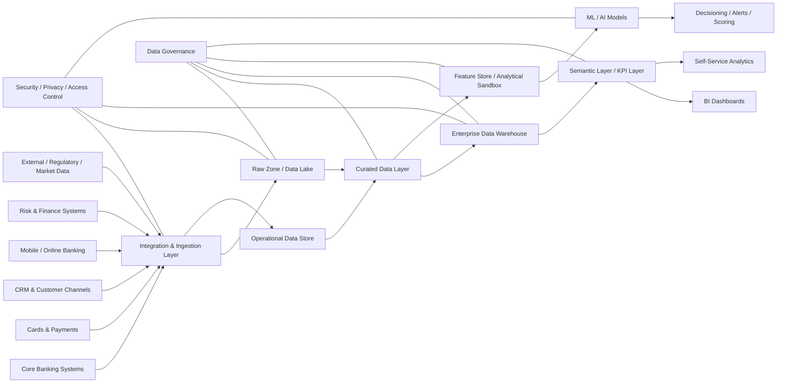
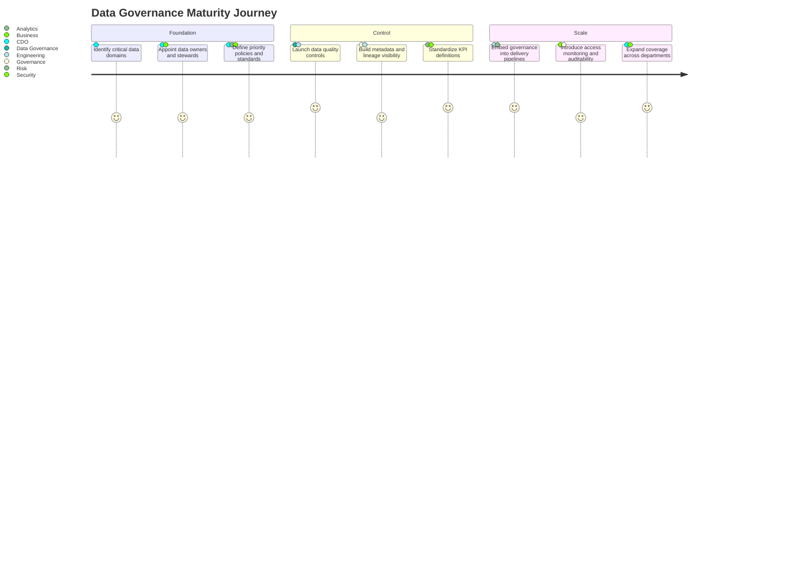
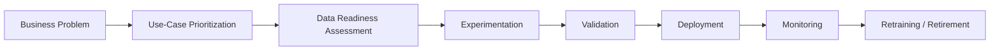
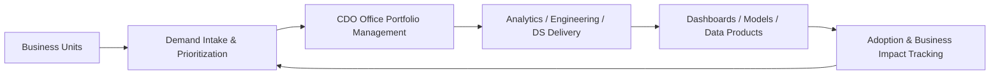
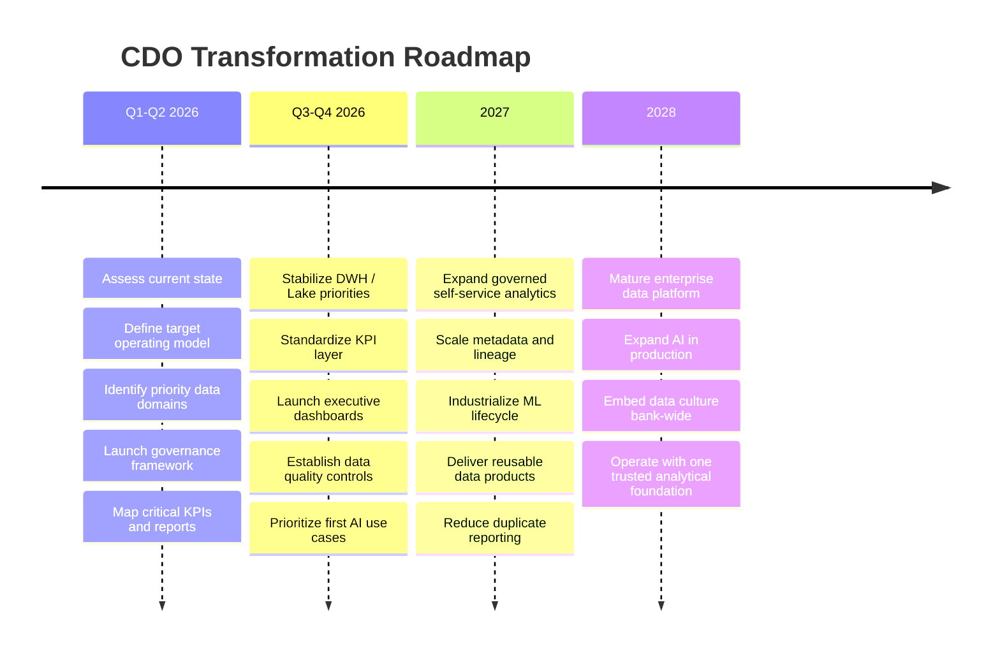

# Vision for the Chief Data Officer Function at Ardshinbank

## Objective {.smaller}

To establish data as a **strategic banking asset** that strengthens regulatory compliance, improves operational efficiency, enables trusted decision-making, and accelerates AI-driven innovation across Ardshinbank.

## Context: Why This Matters Now {.smaller}

Ardshinbank is operating at significant scale, with a broad branch network, diversified banking model, and growing digital footprint. This creates a clear need for a stronger enterprise data function that can unify governance, architecture, analytics, and AI under one strategic direction.

- **Scale requires control**
- **Digital growth requires stronger data foundations**
- **Advanced analytics requires trusted, governed data**
- **AI adoption requires enterprise-grade model governance**
- **Business units need one reliable version of the truth**

## My Vision in One Sentence {.smaller}

Build a **trusted, governed, scalable, and business-driven data organization** that connects data governance, enterprise data platforms, analytics, and data science into one operating model for the bank.

# Why a Bank Needs a Strong Data Function

## Banking is Different {.smaller}

Compared with many other industries, banking requires the data function to support:

- **Regulatory compliance**
- **Data lineage and auditability**
- **Confidentiality and controlled access**
- **Risk transparency**
- **Near real-time operational visibility**
- **Consistent KPI definitions across the bank**
- **Trusted AI adoption with model controls**

## The Mandate of the CDO {.smaller}

The CDO function should unify four responsibilities:

1. **Data Governance**  
   ownership, policies and standards, metadata, data quality, lifecycle management

2. **Enterprise Data Platform**  
   DWH, Data Lake, integration with core and digital systems, scalable and secure architecture

3. **Analytics & BI**  
   standardized KPIs, management dashboards, self-service analytics, reliable reporting

4. **Data Science & AI**  
   use-case prioritization, experimentation, validation, deployment, monitoring

# Strategic North Star

## What Success Looks Like {.smaller}

- One governed enterprise data platform
- One common KPI language across departments
- One data governance framework with clear ownership
- Trusted, auditable, high-quality data pipelines
- Self-service analytics for business teams
- Scalable model lifecycle management
- Controlled rollout of AI and machine learning in high-value domains
- A strong value-driven culture where data is embedded in day-to-day decisions

# Current Challenges to Solve

## Likely Enterprise Data Gaps {.smaller}

- Fragmented data ownership across functions
- Inconsistent KPI definitions between departments
- Reporting duplication and overlapping dashboards
- Limited metadata, lineage, and data quality visibility
- Weak linkage between business priorities and analytical delivery
- High dependency on technical teams for recurring reporting
- Advanced analytics not yet industrialized end-to-end
- AI use cases may emerge faster than governance and controls

## What This Means in Banking {.smaller}

Without a strong CDO function, the bank risks:

- slower decision-making
- reduced trust in reports
- duplicated effort across teams
- regulatory and audit exposure
- weaker prioritization of analytics investments
- delayed industrialization of AI use cases

# Strategic Response

## My Approach {.smaller}

I would build the data function around **three integrated pillars**:

- **Trust**  
  enterprise data governance, ownership, quality controls, metadata, lineage, access controls

- **Scale**  
  modern DWH and Data Lake architecture, reusable data products, governed semantic layer, scalable pipelines

- **Value**  
  standardized reporting, self-service analytics, high-value AI use cases, measurable business impact

# Target Operating Model

## CDO Operating Model {.smaller}

```mermaid
flowchart TB
    A[Chief Data Officer] --> B[Data Governance]
    A --> C[Enterprise Data Platform]
    A --> D[Analytics & BI]
    A --> E[Data Science & AI]

    B --> B1[Data ownership]
    B --> B2[Policies & standards]
    B --> B3[Data quality]
    B --> B4[Metadata & lineage]
    B --> B5[Data access controls]

    C --> C1[Data Warehouse]
    C --> C2[Data Lake]
    C --> C3[Integration layer]
    C --> C4[Core banking & digital systems]
    C --> C5[Security & reliability]

    D --> D1[Executive dashboards]
    D --> D2[Standardized KPIs]
    D --> D3[Self-service analytics]
    D --> D4[Regulatory & management reporting]

    E --> E1[Use-case portfolio]
    E --> E2[ML models]
    E --> E3[Model validation]
    E --> E4[MLOps & monitoring]
    E --> E5[Responsible AI]
```

# Enterprise Data Architecture

## Target Architecture {.smaller}

## Architecture Principles {.smaller}

- **Governed by design**
- **Security by design**
- **Reusable data products**
- **Standardized semantic layer**
- **Traceable lineage**
- **Scalable for both reporting and AI**
- **Separation of raw, curated, and consumption layers**
- **Controlled access based on data sensitivity**

# Governance Model

## Data Governance Should Not Be Bureaucracy {.smaller}

The goal is not to slow the bank down.  
The goal is to make data **trusted, reusable, and scalable**.

- define data domains and owners
- implement data quality controls for critical datasets
- create enterprise business glossary and KPI dictionary
- establish metadata and lineage standards
- formalize data access approval and monitoring
- define retention and lifecycle rules
- connect governance to delivery, not separate from it

## Governance Journey {.smaller}

# Analytics & BI Vision

## From Reporting to Decision Intelligence {.smaller}

The analytics function should evolve from producing reports to enabling decisions.

- remove overlapping and conflicting dashboards
- create a single KPI layer for enterprise reporting
- attach definitions and data dictionary to reports
- prioritize management dashboards over static tables
- increase self-service for business users with governed access
- align analytics backlog with strategic business priorities
- shift from reactive to proactive insight generation

## Reporting Principles {.smaller}

- **One KPI, one definition**
- **One trusted source**
- **Dashboards over manual table-based reporting where appropriate**
- **Business relevance over technical output**
- **Proactive insight generation, not only data delivery**

# Data Science & AI Vision

## AI Adoption Must Be Pragmatic and Controlled {.smaller}

AI in banking should focus on **clear value, strong controls, and measurable outcomes**, not experimentation for its own sake.

- customer propensity and next-best-action
- churn / attrition prevention
- cross-sell and upsell recommendation
- fraud and anomaly detection
- collections optimization
- branch and channel performance optimization
- service quality prediction
- document intelligence and internal process automation

## Model Lifecycle {.smaller}

## Principles for AI Adoption {.smaller}

- start with high-value, high-feasibility use cases
- ensure explainability where needed
- implement model monitoring and periodic review
- align with risk, compliance, and security teams
- treat model governance as part of enterprise governance
- build reusable ML pipelines rather than isolated prototypes

# Business Partnership Model

## The CDO Function Must Be Deeply Embedded {.smaller}

The data office should act as a strategic partner to:

- Retail Banking
- SME / Corporate Banking
- Risk
- Finance
- Operations
- Digital Channels
- IT / Enterprise Architecture
- Information Security
- Internal Audit
- HR

## Engagement Model {.smaller}

# Team Design

## Recommended Core Structure {.smaller}

- **Chief Data Officer**
- **Head of Data Governance**
- **Head of Data Platform / Engineering**
- **Head of Analytics & BI**
- **Head of Data Science / AI**
- data governance specialists
- analytics engineers
- data engineers
- BI developers / analysts
- data scientists
- ML / MLOps capability
- data architects
- business-facing analytics leads

## Extended Model {.smaller}

- **Data Owners** in business and control functions
- **Data Stewards** for key domains
- **Analytics Champions / Ambassadors** across departments

# Roadmap

## 3-Phase Transformation Roadmap {.smaller}

## First 100 Days {.smaller}

- assess architecture, reporting landscape, data quality, governance maturity
- identify critical pain points and quick wins
- map key stakeholders and existing delivery model
- define top enterprise KPIs
- identify critical data domains
- select highest-value use cases for analytics and AI
- assign ownership and stewardship for priority domains
- launch KPI dictionary and metadata baseline
- fix one high-visibility reporting inconsistency
- implement first critical data quality control set

# Cultural Transformation

## Toward a value-driven culture {.smaller}

- **Creating internal demand for trusted data products**
- **Ensuring data consistency and accessibility**
- **Conducting regular stakeholder meetings to align analytics with business demands**
- **Building proactive reporting and alerting**
- **Organizing workshops with relevant departments**
- **Running cross-functional analytical projects**
- **Promoting continuous learning**
- **Making data ownership part of management accountability**

## The Cultural Shift I Want to Create {.smaller}

From:

- report request culture
- siloed data ownership
- fragmented KPIs
- reactive analytics

To:

- product mindset for data
- enterprise ownership
- one KPI language
- proactive and predictive decision-making

# Success Measurement

## Success Metrics for the CDO Function {.smaller}

- % of critical data elements with owner assigned
- % of priority reports linked to KPI dictionary
- data quality issue resolution time
- metadata / lineage coverage for critical datasets
- pipeline reliability
- data availability SLA
- reduction in duplicate reports
- dashboard adoption by business units
- number of use cases in production
- business value delivered by models

# Closing

## Final Thought {.smaller}

My vision is to help Ardshinbank build a data function that is not only technically strong, but institutionally trusted.

- governance strengthens delivery
- architecture enables scale
- analytics support decisions
- AI creates measurable value
- data becomes a shared strategic language across the bank
